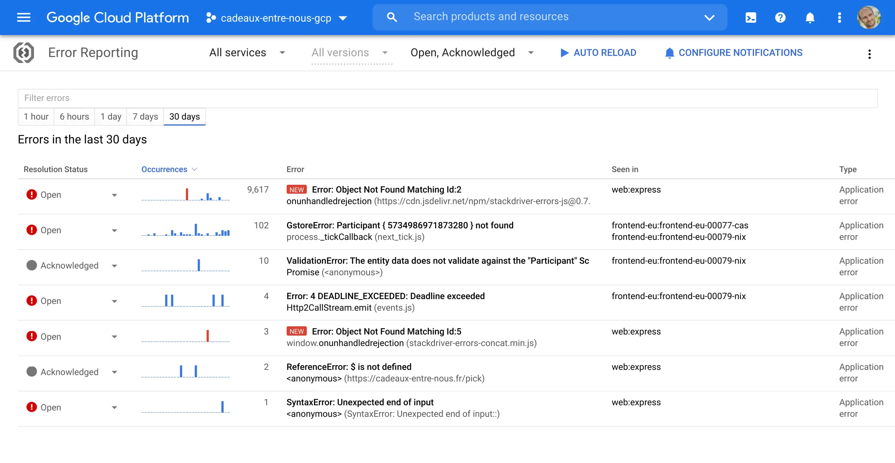

👋 Hi,  

I am Steren, <a href="https://www.ec-lyon.fr/" target="_blank" rel="noopener">engineer</a> turned <a href="https://www.linkedin.com/in/steren" target="_blank" rel="me nofollow">Product Manager</a>.
I started and lead <a href="https://cloud.google.com/run" target="_blank" rel="noopener">Google Cloud Run</a>.

I <a href="https://twitter.com/steren" target="_blank" rel="me nofollow">tweet</a>, <a href="https://talks.steren.fr" target="_blank" rel="me nofollow">talk</a>, <a href="https://labs.steren.fr" target="_blank" rel="me nofollow">experiment</a>, <a href="https://blog.steren.fr" target="_blank" rel="me nofollow">blog</a>, and <a href="https://github.com/steren" target="_blank" rel="me nofollow">build</a>:

  
**[Cloud Carbon Footprint](https://cloud.google.com/carbon-footprint)**  
Understand and reduce your Google Cloud carbon emissions.

  
**[Cloud Run](https://cloud.run)**  
Google Cloud's serverless runtime.

  
**[Cloud Error Reporting](https://cloud.google.com/error-reporting/)**  
Identify and understand application errors.

  
**[Joshfire Factory](https://www.dailymotion.com/video/xuy6pq)**  
Multi-device application platform.

  
**[Cadeaux entre nous](https://cadeaux-entre-nous.fr)**  
Secret Santa website.

  
**[CAPODA](https://www.youtube.com/watch?v=khWXdkryBE4)**  
Animated short movie.
