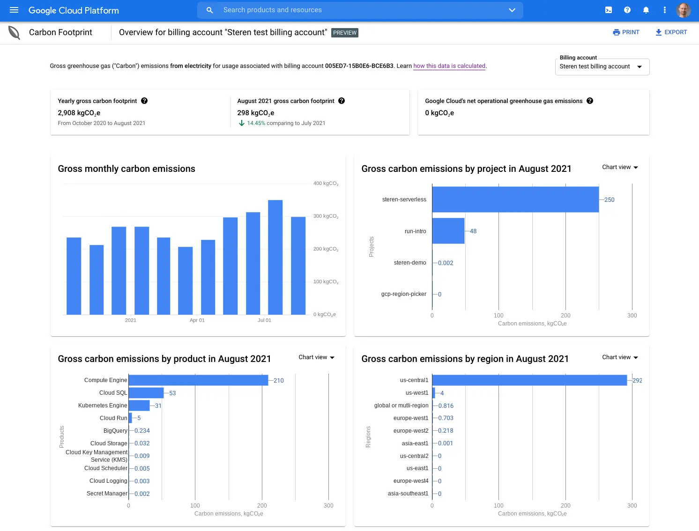
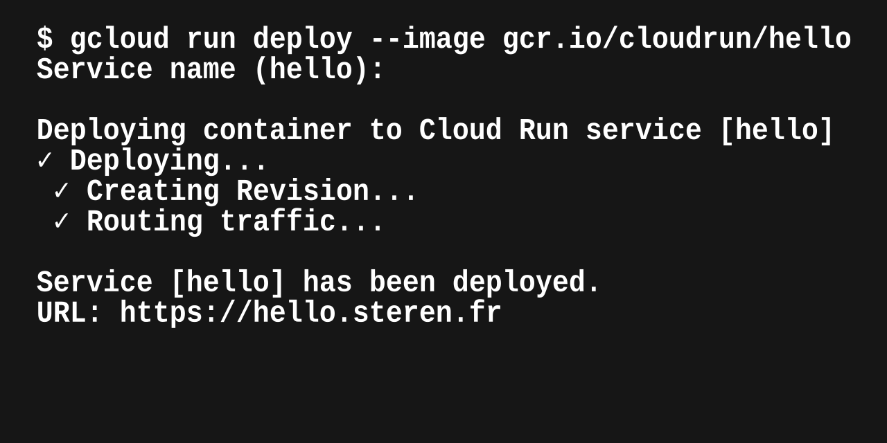
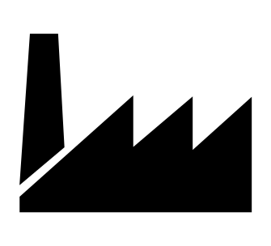
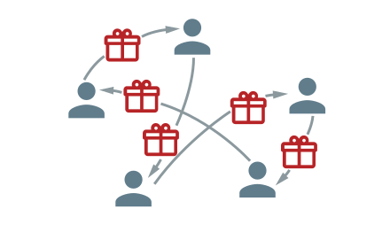

👋 Hi,  

I am [Steren](https://steren.fr), engineer turned [Product Manager](https://www.linkedin.com/in/steren).
I started and lead [Google Cloud Run](https://cloud.google.com/run).

I [tweet](https://twitter.com/steren), [talk](https://talks.steren.fr), [experiment](https://labs.steren.fr), [blog](https://blog.steren.fr), and [build](https://github.com/steren):

  
**[Cloud Carbon Footprint](https://cloud.google.com/carbon-footprint)**  
Understand and reduce your Google Cloud carbon emissions.

  
**[Cloud Run](https://cloud.run)**  
Google Cloud's serverless runtime.

  
**[Beansight](https://www.beansight.com)**  
Prediction market.

  
**[Joshfire Factory](https://www.dailymotion.com/video/xuy6pq)**  
Multi-device application platform.

  
**[Cadeaux entre nous](https://cadeaux-entre-nous.fr)**  
Secret Santa website.

  
**[CAPODA](https://www.youtube.com/watch?v=khWXdkryBE4)**  
Animated short movie.
